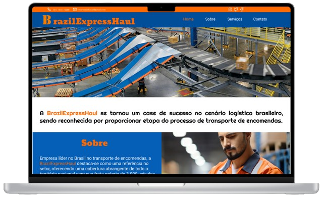
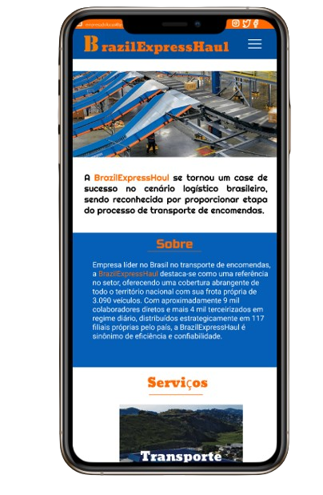

# Brasil Express Haul

Bem-vindo ao site da Brasil Express Haul, sua escolha inteligente para um transporte rápido, seguro e confiável em todo o Brasil.

 

## Demo

brazilexpress.netlify.app

## Tecnologias Utilizadas

ㅤㅤ
ㅤ

## Descrição

Desenvolvido com HTML5 e CSS3, o site da Brasil Express Haul apresenta um layout moderno e funcional, projetado para fornecer informações importantes de forma clara e acessível aos usuários. Com uma combinação de imagens ilustrativas e texto descritivo, o site destaca os serviços oferecidos pela empresa e sua posição de destaque no setor de transporte de encomendas no Brasil.

## Como rodar o projeto

O projeto é um site estático, portanto, requer apenas que você clone o projeto no seu dispositivo local para abrir o arquivo HTML e visualizá-lo, o site, no navegador.

## Contribuição

Contribuições são bem-vindas! Sinta-se à vontade para abrir uma issue ou enviar um pull request com melhorias, correções de bugs ou novos recursos.

---

### Explore o Mundo da Brasil Express Haul!

Aproveite a experiência de navegação e conheça mais sobre os serviços e diferenciais oferecidos pela Brasil Express Haul!
